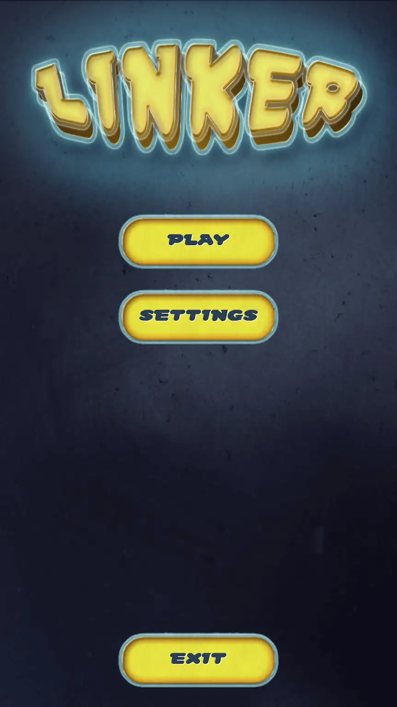
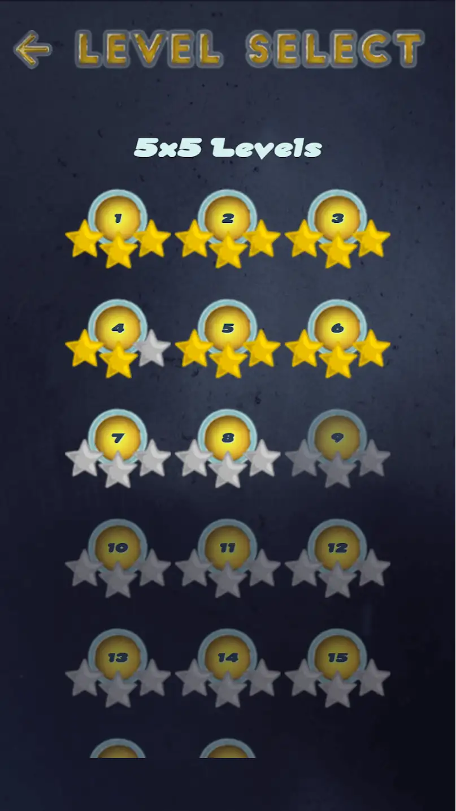
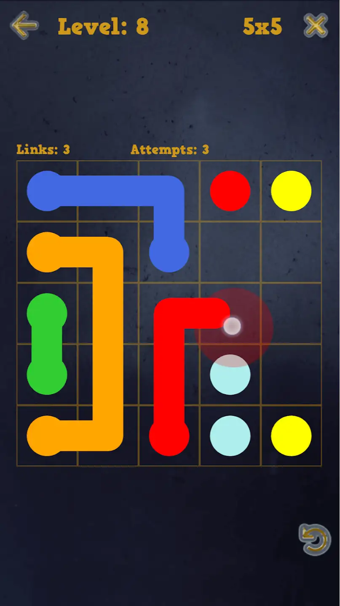
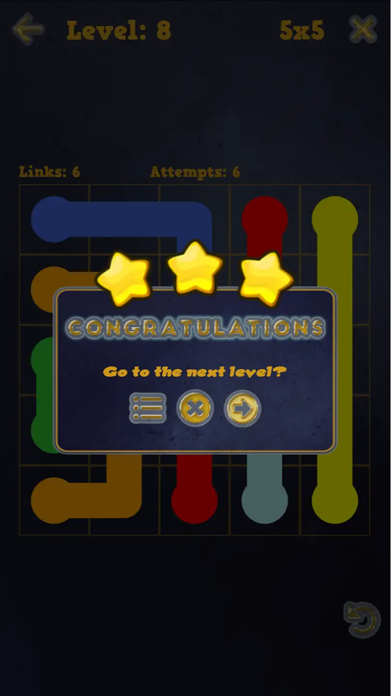
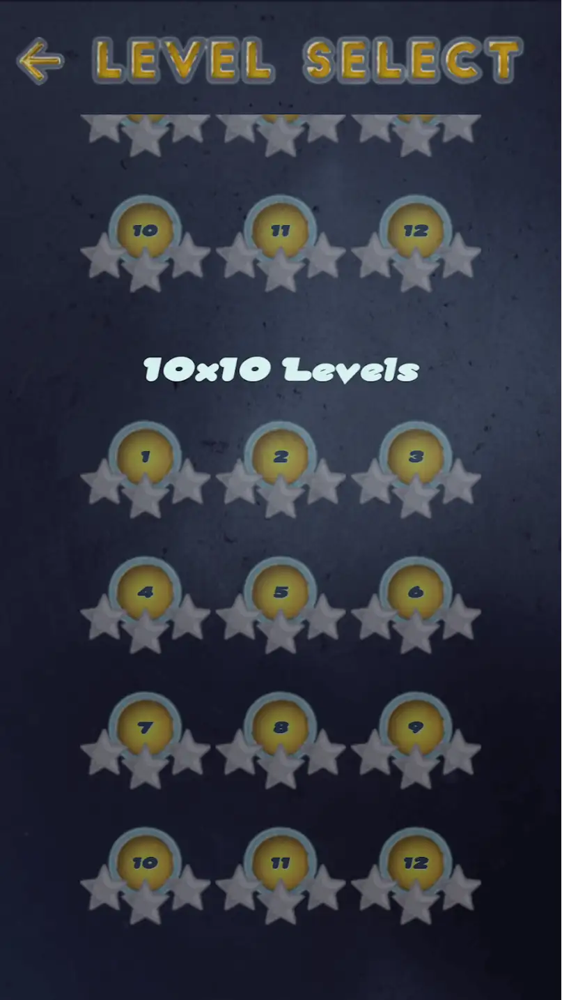

# Linker

Draw links and fill the board

Simple and addictive linking game, with a wide range of puzzle sizes.

Challenge yourself with different board sizes, from 5x5 to 10x10. The initial release of Linker includes 50 puzzles for each board size.

# Screenshots

